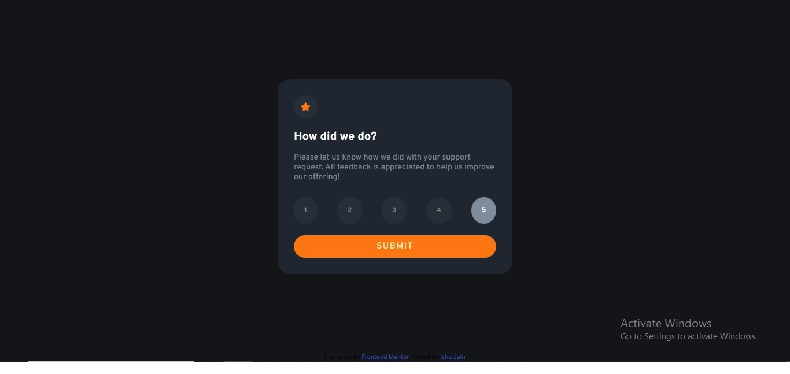
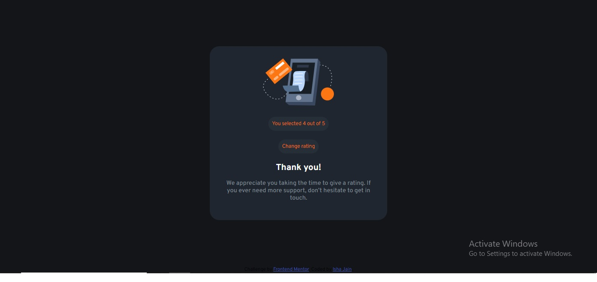

# Frontend Mentor - Interactive rating component solution

This is a solution to the [Interactive rating component challenge on Frontend Mentor](https://www.frontendmentor.io/challenges/interactive-rating-component-koxpeBUmI). Frontend Mentor challenges helps us to improve our coding skills by building realistic projects. 

## Table of contents

- [Overview](#overview)
  - [The challenge](#the-challenge)
  - [Screenshot](#screenshot)
  - [Links](#links)
  - [Built with](#built-with)
- [Author](#author)

## Overview
  - An interactive rating component using just flexbox layout and javascript.

### The challenge

Users are able to:

- View the optimal layout for the app depending on their device's screen size
- See hover states for all interactive elements on the page
- Select and submit a number rating
- See the "Thank you" card state after submitting a rating

### Screenshot

### Links

- Solution URL: [https://github.com/isha71/Interactive-rating-component]
- Live Site URL: [https://isha71.github.io/Interactive-rating-component/]

### Built with

- Semantic HTML5 markup
- CSS custom properties
- Flexbox
- JavaScript 
- DOM

## Author

- Website - [Isha Jain](https://isha71.github.io/Personal-site/)
- Frontend Mentor - [@isha71](https://www.frontendmentor.io/profile/isha71)
